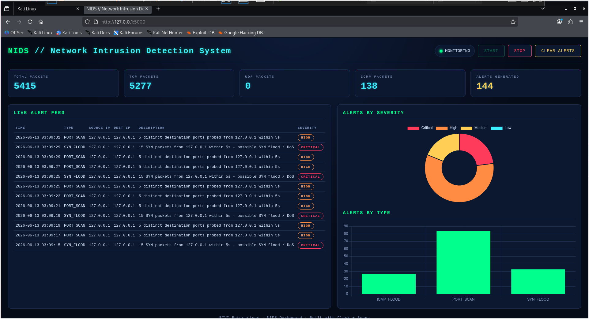
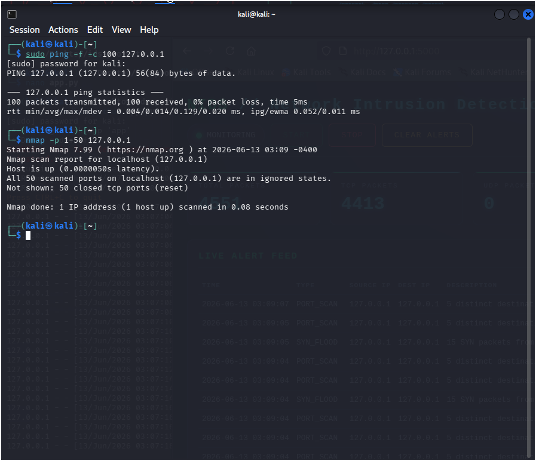
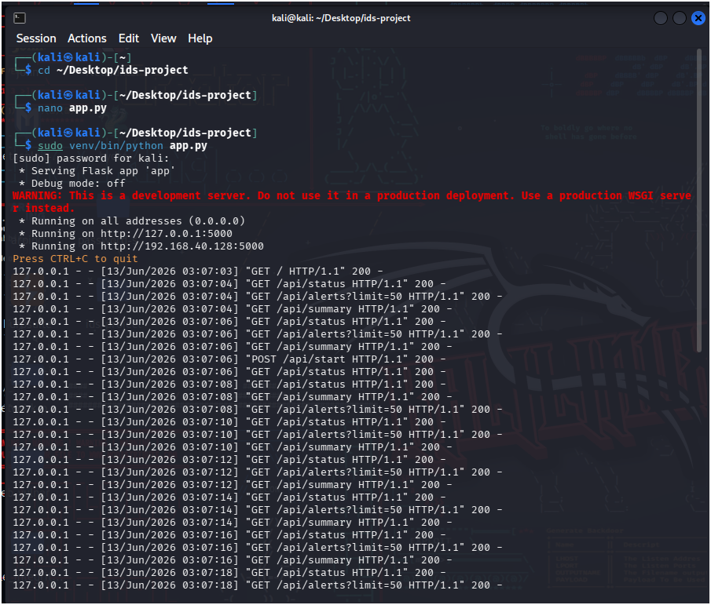

# 🛡️ IDS — Intrusion Detection System

A lightweight, real-time **Intrusion Detection System (IDS)** built with **Python, Scapy, and Flask**. It sniffs live network traffic, applies threshold-based detection rules for common attack patterns (port scans, SYN floods, ICMP floods), logs every finding to SQLite, and visualizes everything on a live cyberpunk-styled dashboard.

> Built as a portfolio / learning project to demonstrate practical packet analysis, threat detection logic, and full-stack security tooling.

---

## 📸 Live Demo Screenshots

### Dashboard — Real-time Alerts & Analytics


### Attack Simulation (Port Scan / SYN Flood / ICMP Flood Detection)


### Flask Server Running


---

## ✨ Features

- **Live packet capture** using Scapy (TCP / UDP / ICMP)
- **Real-time detection rules:**
  - 🔍 **Port Scan Detection** — flags a source IP probing many distinct ports in a short window
  - 🌊 **SYN Flood Detection** — flags abnormal SYN packet rates (possible DoS)
  - 📡 **ICMP Flood Detection** — flags ping flood behavior
- **Persistent alert storage** in SQLite (`alerts.db`)
- **Live dashboard** (auto-refreshing) showing:
  - Packet/protocol counters
  - Alert feed with severity tagging
  - Severity & alert-type charts (Chart.js)
- **REST API** to start/stop the engine, fetch alerts, and pull summary stats
- **Configurable detection thresholds** — tune sensitivity per environment

---

## 🏗️ Architecture
┌──────────────────┐      packets       ┌────────────────────┐

│  Network Traffic  │ ─────────────────▶ │     ids_core.py     │

│   (live NIC /     │                    │  Scapy sniffer +     │

│    interface)     │                    │  detection rules     │

└──────────────────┘                    └─────────┬───────────┘

│ alerts

▼

┌────────────────────┐

│   db_handler.py     │

│   SQLite (alerts.db)│

└─────────┬───────────┘

│ reads

▼

┌────────────────────┐

│      app.py         │

│  Flask REST API +    │

│  dashboard route     │

└─────────┬───────────┘

│ HTTP / JSON

▼

┌────────────────────┐

│  templates/         │

│   dashboard.html     │

│  Live UI (Chart.js)  │

└────────────────────┘

---

## 📁 Project Structure
ids-project/

├── app.py                 # Flask app: routes, REST API

├── ids_core.py            # Core sniffing + detection engine

├── db_handler.py          # SQLite persistence layer

├── templates/

│   └── dashboard.html     # Live dashboard UI

├── screenshots/           # Demo screenshots

├── requirements.txt

├── .gitignore

├── alerts.db               # created at runtime (ignored by git)

├── SECURITY.md

├── CONTRIBUTING.md

├── LICENSE

└── README.md

---

## ⚙️ Detection Logic

| Rule         | Trigger Condition                                              | Default Severity |
|--------------|-----------------------------------------------------------------|-------------------|
| Port Scan    | ≥ 5 distinct destination ports from one source IP within 5s     | High              |
| SYN Flood    | ≥ 15 SYN-only TCP packets from one source IP within 5s          | Critical          |
| ICMP Flood   | ≥ 5 ICMP echo packets from one source IP within 5s              | Medium            |

All thresholds are defined as class constants at the top of `IDSEngine` in `ids_core.py` and can be tuned for your environment. The values above are tuned for fast demo/testing; for production use, raise them (e.g. 10 ports / 50 SYN / 20 ICMP) to reduce false positives.

---

## 🚀 Getting Started

### 1. Prerequisites
- Python 3.10+
- `libpcap` / `Npcap` (required by Scapy for packet capture — Npcap on Windows, included by default on most Linux distros)
- Administrator / root privileges (raw socket access)

### 2. Setup

```bash
# Clone the repo
git clone https://github.com/rithisingh2020/ids-project.git
cd ids-project

# Create & activate a virtual environment
python -m venv venv
source venv/bin/activate        # Linux / macOS
venv\Scripts\activate           # Windows

# Install dependencies
pip install -r requirements.txt
```

### 3. Run

Packet capture requires elevated privileges:

```bash
# Linux / macOS
sudo venv/bin/python app.py

# Windows (run terminal as Administrator)
python app.py
```

### 4. Open the Dashboard

Navigate to: **http://127.0.0.1:5000**

Click **Start** to begin live monitoring. Alerts will populate in real time as matching traffic is observed.

---

## 🔌 API Reference

| Endpoint               | Method | Description                                |
|-------------------------|--------|----------------------------------------------|
| `/`                     | GET    | Serves the dashboard                          |
| `/api/status`           | GET    | Engine running state + packet/alert counters  |
| `/api/start`            | POST   | Start the sniffer engine                      |
| `/api/stop`             | POST   | Stop the sniffer engine                       |
| `/api/alerts?limit=&severity=` | GET | Fetch recent alerts (optionally filtered)|
| `/api/alerts/clear`     | POST   | Clear all stored alerts                       |
| `/api/summary`          | GET    | Alert counts grouped by severity & type       |

---

## 🧪 Testing It Out

Generate traffic that triggers the rules on your own machine (loopback interface):

```bash
# ICMP flood simulation
sudo ping -f -c 100 127.0.0.1

# Port scan simulation (requires nmap)
nmap -p 1-50 127.0.0.1
```

> ⚠️ Only run these against systems and networks you own or are explicitly authorized to test. Unauthorized scanning/flooding is illegal.

---

## 🛣️ Roadmap / Future Enhancements

- [ ] Add ARP spoofing & DNS tunneling detection rules
- [ ] Email / Telegram alert notifications
- [ ] Export alerts to CSV/PDF reports
- [ ] Geo-IP lookup for source addresses
- [ ] Dockerize for one-command deployment
- [ ] Add unit tests for detection logic (pytest)

---

## 🧰 Tech Stack

- **Python 3** — core language
- **Scapy** — packet capture & parsing
- **Flask** — web framework / REST API
- **SQLite** — lightweight alert storage
- **Chart.js** — dashboard visualizations
- **HTML / CSS / vanilla JS** — frontend

---

## 👩‍💻 Author

**Rithika U**
Cybersecurity Enthusiast | Founder, RIVI Enterprises
- GitHub: [@rithisingh2020](https://github.com/rithisingh2020)
- LinkedIn: [rithikasingh2626](https://linkedin.com/in/rithikasingh2626)

---

## ⚠️ Disclaimer

This project is intended for **educational and authorized security testing purposes only**. Always obtain explicit permission before monitoring or testing any network you do not own.

## 🔒 Security

See [SECURITY.md](SECURITY.md) for our responsible disclosure policy and security considerations.

## 🤝 Contributing

See [CONTRIBUTING.md](CONTRIBUTING.md) for guidelines on adding new detection rules and submitting changes.

## 📄 License

Released under the [MIT License](LICENSE).
